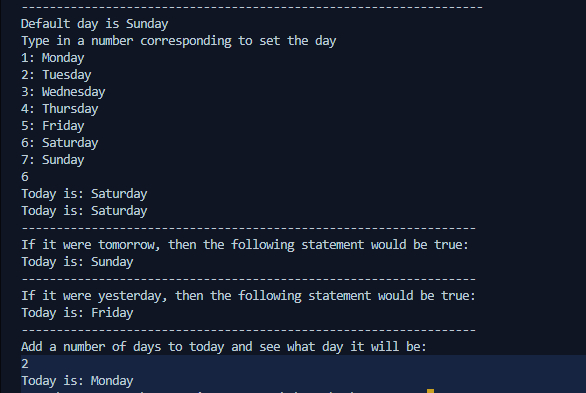

This program is a simple C++ program that uses classes to set, return and calculate the current day of the week. The program prompts the user to input a number between 1-7 to set the current day of the week. The user can then return the current day, return the next day, return the previous day and calculate what day it will be after a certain number of days have passed

### Output
